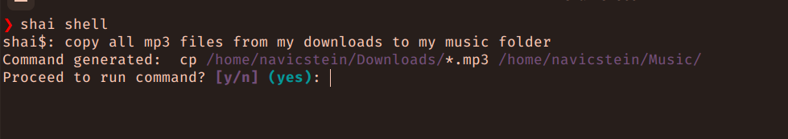
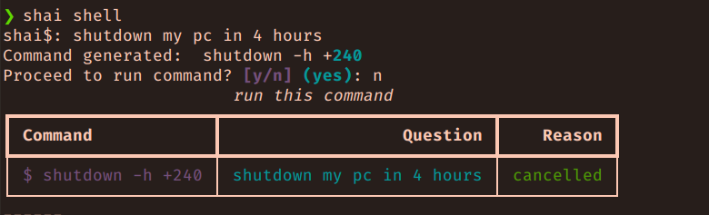
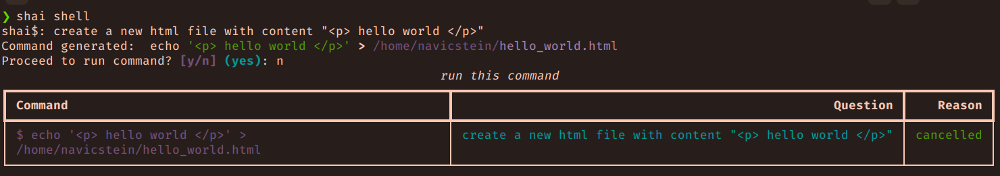

# shai

shai is a command line utility that allows you to interact with your computer using natural language. Simply write what you want to do, and shai will generate the necessary command to make it happen.

shai is built on top of LangChain and LiteLLM libraries, and uses the Typer framework for the interactive CLI.

# Images





# Features

shai uses LiteLLM which mean that you can use any model/provider of your choice, you can even use local models provider, eg. Ollama

- Use any provider of your choice, eg. Ollama, Groq, Together, OpenAI, etc.
- Can execute shell command (coming soon)
- Can run Offline without internet
- Can run on any OS - thanks to Python
- Uses LangChain - An open-source library to simplify LLM calls.
- Uses LiteLLM - An open-source library to simplify LLM completion + embedding calls.
- Uses Typer - the interactive CLI

## Installation

shai is a python package built with poetry, so you can install it using poetry:

> for now i'll recommend you clone the repo then install with poetry,

```bash
$ gh repo clone navicstein/shai
$ cd shai
$ poetry env use python3.11 && poetry shell (or source $(poetry env info --path)/bin/activate)
$ poetry install
```

<!-- ```bash
$ poetry add "git+https://github.com/navicstein/shai.git"
``` -->

## Configuration (coming soon)

shai is still pending, but in the meantime, please see `.env.example`

## Usage

You can drop right into the Repl by running:

```bash
$ shai shell
```

then proceed to tell it what you want to do.

example commands are:

- shutdown my pc in 4 hours
- copy all mp3 files from my downloads to my music folder
- find all text files that has "hello world", then move them to my downloads folder
- search for "hello world" in all text files in my downloads folder and move them to my music folder
- move all video file on my desktop to my downloads

### Explain command (coming soon)

```bash
$ shai explan "grep -rl 'hello world' /home/user/Downloads/*.txt | xargs -I {} mv {} /home/user/Music"
```
